# Cloudlift Quickstart

Cloudlift is an in-house infrastructure tool created by Simpl to simplify the process of creating and deploying ECS workloads. It assumes the organization follows the 12-factor app design principles. This quickstart guide will walk you through the installation, configuration, and usage of Cloudlift.

## Table of Contents
- [Cloudlift Quickstart](#cloudlift-quickstart)
	- [Summary](#summary)
	- [Prerequisites](#prerequisites)
	- [Installation](#installation)
	- [Configuration](#configuration)
	- [Using Cloudlift](#using-cloudlift)
	  - [Environments](#environments)
- [Cloudlift Tutorial](#cloudlift-tutorial)
  - [Creating an Environment](#creating-an-environment)
  - [Creating a Service](#creating-a-service)
   - [Deploying a Service](#deploying-a-service)
  -  [Updating a Service](#updating-a-service)
  -  [Uploading an Image to ECR with Local Image Tag](#uploading-an-image-to-ecr-with-local-image-tag)
  - [Deploying a Different Version of the Service Based on Git Branch](#deploying-a-different-version-of-the-service-based-on-git-branch)
 - [Cloudlift Autoposy](#cloudlift-autopsy)
	 - [create_environment](#create_environment)
	 - [create_service](#create_service)
	 - [deploy_service](#deploy_service)
	 - [update_service](#update_service)
 - [A Tale of Cloudlift: Streamlining Deployments with Simplicity](#a-tale-of-cloudlift-streamlining-deployments-with-simplicity)

## Summary
Cloudlift is a powerful tool designed to simplify the deployment of ECS workloads. It streamlines the process for application engineers and assumes adherence to the 12-factor app design principles. With Cloudlift, you can easily create and deploy services, manage environment-specific configurations, and automate your deployment pipeline.


## Prerequisites
Before installing Cloudlift, ensure you have the following prerequisites:

- **Python 3.6**: Cloudlift requires a working Python environment with at least Python 3.6 installed.
- **pip**: Ensure you have pip, the Python package installer, installed on your system. If you don't have it, you can install it by running the following command:
  ```
  curl https://bootstrap.pypa.io/get-pip.py -o get-pip.py | python get-pip.py
  ```
- **AWS CLI**: Cloudlift interacts with AWS services, so you need to have the AWS Command Line Interface (CLI) installed and configured on your machine. If you don't have it installed, you can follow the instructions in the [AWS CLI User Guide](https://docs.aws.amazon.com/cli/latest/userguide/cli-configure-files.html) to install and configure it.

Ensure that you have all the prerequisites in place before proceeding with the installation of Cloudlift.
## Installation
To install Cloudlift, follow these steps:

1. Open a terminal or command prompt.
2. Run the following command to install Cloudlift:
   ```
   pip install cloudlift
   ```
3. Wait for the installation to complete.

Congratulations! You now have Cloudlift installed and ready to use.


## Configuration
Before using Cloudlift, you need to configure it to match your environment and application requirements. Follow these steps to set up your configuration:

### AWS Configuration

1. Install and configure the AWS CLI:
   - Install the AWS CLI by following the instructions provided by AWS.
   - Configure the AWS CLI by running the following command in your terminal or command prompt:
     ```shell
     aws configure
     ```
   - Enter your AWS Access Key ID, AWS Secret Access Key, default region, and output format when prompted. You can find instructions on how to get Access Key ID and Secret Access Key in the [AWS Identity and Access Management (IAM) User Guide](http://docs.aws.amazon.com/IAM/latest/UserGuide/id_credentials_access-keys.html).

2. Using AWS Profiles:
   - If you are using [AWS profiles](https://docs.aws.amazon.com/cli/latest/userguide/cli-configure-profiles.html), set the desired profile name in the environment before invoking Cloudlift. You have two options to set the profile:
     - Option 1: Set the profile name for a specific command:
       ```shell
       AWS_DEFAULT_PROFILE=<profile name> cloudlift <command>
       ```
     - Option 2: Export the profile name as an environment variable for the current session:
       ```shell
       export AWS_DEFAULT_PROFILE=<profile name>
       cloudlift <command>
       cloudlift <command>
       ```

Ensure that you have properly configured your environment-specific variables and AWS credentials/profiles before using Cloudlift. This will allow Cloudlift to interact with your application's environment and AWS resources effectively.

### Environment Variables Configuration

1. Navigate to your project directory in the terminal or command prompt.
2. Create an `env.sample` file that contains the key-value pairs for your environment-specific variables. Make sure to only include the key names and not the actual values. Here is an example of the format:
   ```
   KEY1=
   KEY2=
   ```
   Customize the keys based on your application's requirements.
3. Commit the `env.sample` file along with your application code to keep them synchronized. This will serve as a template for your actual environment-specific configuration.


## Using Cloudlift
Now that you have Cloudlift installed and configured, here are some key concepts you should familiarize yourself with before getting started with the cloudlift service documentation:

1. **Service:** A cloudlift service is responsible for creating one or more ECS services in a target environment. It helps in managing the deployment and runtime parameters of your application.

2. **Service Configuration:** The service configuration defines the runtime parameters of your application. It includes essential details such as the docker command, memory requirements, notification channel, and load-balancer specifications. A service can consist of a combination of web applications, background daemons, job schedulers, and even multiple Kafka consumers.

3. **Tasks:** An active ECS service must have at least one running task. In the context of cloudlift, tasks refer to the running Docker containers that make up your service. By default, a single task is deployed, but if you require horizontal scaling, you can adjust the desired number of tasks in the AWS console. For autoscaling based on incoming requests, it is recommended to reach out to the infrastructure team for assistance.

4. **Environment Variables:** Environment variables are environment-specific settings that need to be specified separately for each environment. These variables allow you to configure various aspects of your application based on the specific environment it is deployed in.

Now you can start using cloudlift to simplify your deployment process. Here's a basic workflow to get you started:

1. Set environment variables:
   - Run `cloudlift edit_config -e <environment>` to open an editor and set the key-value pairs for your environment variables. Make sure the keys match the ones in your `.env.sample` file. Please follow [Environments](#environments) section for more info about `<environment>`.
   - In the editor, enter the environment variables in the following format:
     ```
     KEY1=VALUE1
     KEY2=VALUE2
     ```
     Replace `KEY1`, `KEY2`, etc., with the corresponding keys defined in your `.env.sample` file, and provide the desired values for each key.

2. Create a service:
   - Run `cloudlift create_service -e <environment>` to create a new service. This will open a service configuration template in your editor.
   - Customize the template to match your application's runtime parameters, such as the Docker command, memory requirements, and load-balancer specifications.

3. Deploy the service:
   - Once the service is created, use `cloudlift deploy_service -e <environment>` to deploy it to the specified environment.
   - Cloudlift will build the Docker image, tag it appropriately, upload it to the container repository, and deploy it to the ECS service.

### Environments

Environments in Cloudlift are created and managed by the infrastructure team. At Simpl, the following environments are used:

- **Unicorn**: This environment is dedicated to integration tests in CI/CD pipelines. It provides a controlled environment for testing new features and changes before promoting them to other environments.

- **Staging**: The staging environment is designed for development purposes. It allows developers to test their code and verify its functionality in an environment similar to the production environment.

- **Sandbox**: The sandbox environment is used for merchant integration testing. It provides a dedicated space for merchants to integrate their services with Simpl's platform and perform end-to-end testing.

- **Production**: This is the live production environment where the fully tested and validated services are deployed to serve real-world traffic.

**Note:**  Please note that these environments are already created by the infrastructure team at Simpl. Cloudlift leverages these environments to provide a seamless and standardized deployment experience.

Congratulations! You have completed the Cloudlift Quickstart guide. Now you can leverage the power of Cloudlift to simplify your deployment workflow and focus on building great applications following the 12-factor app design principles.

Cloudlift also offers advanced features such as integration with CI/CD tools, Fargate support, and the ability to create and update task definitions. For more detailed information and advanced usage, refer to the comprehensive [Cloudlift Tutorial](#cloudlift-tutorial).

# Cloudlift Tutorial

Welcome to the Cloudlift Tutorial! In this tutorial, we will explore the key features and workflows of Cloudlift, a powerful tool for simplifying the deployment of dockerized services in AWS ECS. Let's dive in!

## Creating an Environment

Before deploying services, it's important to set up the environment in which they will run. An environment in Cloudlift represents a specific configuration and infrastructure setup. Cloudlift will handle the creation of various components such as security groups, private and public subnets, and an ECS cluster with auto scaling groups for spot and on-demand instances. Follow these steps to create a new environment:

1. Open your terminal or command prompt.
2. Run the command `cloudlift create_environment -e <environment-name>` to initiate the environment creation process.
3. Provide the required information, such as AWS region, VPC CIDR, NAT Elastic IP allocation ID, subnet CIDRs, minimum and maximum instances for the cluster, SSH key name, SNS ARN for notifications, and AWS ACM ARN for SSL certificate.
   - **NAT Elastic IP allocation ID**: To obtain a NAT Elastic IP allocation ID, follow these steps:
     - Go to the AWS Management Console and navigate to the EC2 section.
     - Create a new Elastic IP address.
     - Ensure that the Elastic IP is not already associated with any VPC.
     - Note down the allocation ID of the newly created Elastic IP.
   - **SNS ARN for notifications**: To set up an SNS topic for notifications, follow these steps:
     - Go to the AWS Management Console and navigate to the SNS section.
     - Create a new topic and note down the ARN of the topic.
   - **SSL certificate ARN**: To obtain an SSL certificate ARN from AWS Certificate Manager, follow these steps:
     - Go to the AWS Management Console and navigate to the ACM section.
     - Request or import an SSL certificate for your domain.
     - Note down the ARN of the SSL certificate.
4. Once you've entered all the necessary information, Cloudlift will generate a configuration file for the environment.
5. The configuration file will be in JSON format and will contain various sections such as cluster settings, environment settings, region settings, VPC settings, and subnet settings.
6. Customize the configuration file by specifying the desired instance type, SSH key name, number of minimum and maximum instances, NAT gateway settings, subnet CIDRs, and other parameters as needed.
7. Save the configuration file.

With the environment created, you now have a dedicated space to deploy your services.

Here is an example of how the configuration may look:

```json
{
    "staging": {
        "cluster": {
            "ecs_instance_default_lifecycle_type": "ondeamnd",
            "instance_type": "<instance_type>",
            "key_name": "<ssh_key_name>",
            "max_instances": <max_instances>,
            "min_instances": <min_instances>,
            "spot_max_instances": <spot_max_instances>,
            "spot_min_instances": <spot_min_instances>,
        },
        "environment": {
            "notifications_arn": "<sns_topic_arn>",
            "ssl_certificate_arn": "<ssl_certificate_arn>",
        },
        "region": "<region>",
        "vpc": {
            "cidr": "<vpc_cidr>",
            "nat-gateway": {
                "elastic-ip-allocation-id": "<elastic_ip_allocation_id>",
            },
            "subnets": {
                "private": {
                    "subnet-1": {
                        "cidr": "<private_subnet_1_cidr>",
                    },
                    "subnet-2": {
                        "cidr": "<private_subnet_2_cidr>",
                    }
                },
                "public": {
                    "subnet-1": {
                        "cidr": "<public_subnet_1_cidr>",
                    },
                    "subnet-2": {
                        "cidr": "<public_subnet_2_cidr>",
                    }
                }
            }
        }
    }
}
```
Please note that the above example is just a template, and you should replace the placeholder values (`<...>`) with the actual values specific to your environment. Additionally, Cloudlift supports both spot instances and  on-demand instances for your ECS cluster. Spot instances can help save costs, as they offer unused capacity at a lower price, while  on-demand instances provide guaranteed availability at a fixed price. You can choose the appropriate instance type and lifecycle configuration based on your requirements and budget.


## Creating a Service

Before creating a service with Cloudlift, make sure your project directory contains an `env.sample` file with the environment variable keys required by the service. The `env.sample` file should have the keys listed, without any values assigned. For example, if you have an environment variable called `VERSION`, the `env.sample` file should contain `VERSION=`. Leave the file empty if neither of the services require an environment variable. The `env.sample` file can be committed to your Git repository.

You also need to have a `Dockerfile` present in your project directory. Ensure that the `Dockerfile` specifies the necessary configurations for building your Docker image.

To create a service, follow these steps:

1. Open your terminal or command prompt.
2. Navigate to the project directory of your service.
3. Run the command `cloudlift edit_config -e <environment-name>` to add environment variables and configurations to the service (If any environment variable key is listen in `env.sample` file).
   - This command will open an interactive prompt where you can enter the environment variables mentioned in your `env.sample` file. Provide the corresponding values for each environment variable. These environment variables will be stored securely in the AWS Systems Manager (Parameter Store).
   - If your service does not require any environment variables, you can simply skip this step.
4. Once the configuration is updated, run the command `cloudlift create_service -e <environment-name> --name <name-of-the-service>`. The `--name` flag is optional, and if not provided, the current working directory name will be considered as the service name.
5. Cloudlift will create a new ECS service based on the provided configuration. It will automatically generate the task definition using the Dockerfile and environment variables specified in the `env.sample` file.

Keep the SNS topic ARN handy, as you will need it during the creation of the service configuration.

Here is an example of a service configuration:

```json
{
    "notifications_arn": "<sns-topic-arn>",
    "services": {
        "<service-name>": {
            "command": "<docker-command-or-null>",
            "memory_reservation": <memory-reservation>,
            "custom_metrics": {
                "metrics_port": "<metrics-port>",
                "metrics_path": "<metrics-path>"
            },
            "http_interface": {
                "container_port": <container-port>,
                "internal": <true-or-false>,
                "restrict_access_to": [
                    "<ip-address>",
                    "<ip-address>"
                ]
            },
            "volume": {
                "efs_id": "<efs-id>",
                "efs_directory_path": "<efs-directory-path>",
                "container_path": "<container-path>"
            },
            "logging": "<logging-option-or-null>"
        }
    }
}
```

Ensure that you replace the placeholders (`<...>`) with the actual values specific to your service configuration.


### Required Fields

The following fields are required in the configuration object:

- `notifications_arn`: A string representing the Amazon Resource Name (ARN) of the SNS topic to which notifications will be sent.

- `services`: An object representing the services to be configured. The keys of this object are the names of the services, and the values are objects containing configuration information for each service.


### Service Configuration

Each service object must contain the following fields:

- `command`: A string or null value representing the command to be run in the Docker container. If this field is null, the command specified in the Dockerfile will be used.

- `memory_reservation`: A number representing the soft memory limit for the container. The hard limit will automatically be set to 1.5 times the soft limit.

In addition, a service object may contain any of the following optional fields:

- `custom_metrics`: An object containing configuration information for exporting custom metrics to a Prometheus server. This field is only used if custom metrics are required.


    > **NOTE:** If you use custom metrics, Your ECS container Network mode will be `awsvpc`. 

    > **⚠ WARNING:** If you are adding custom metrics to your existing service, there will be a downtime.

  - `metrics_port`: A string representing the port number on which custom metrics are exported.
  
  - `metrics_path`: A string representing the path on which custom metrics are exported.

- `http_interface`: An object containing configuration information for setting up an Application Load Balancer (ALB) for the service. This field is only used if an ALB is required.

  - `container_port`: A number representing the port number on which the service is running inside the container.
  
  - `internal`: A boolean value indicating whether the ALB should be internal. If set to false, the ALB will be public.
  
  - `restrict_access_to`: An array of strings representing the IP addresses that should be allowed to access the ALB.

- `volume`: An object containing configuration information for mounting an Amazon Elastic File System (EFS) volume to the service. This field is only used if an EFS volume is required.

  - `efs_id`: A string representing the ID of the EFS volume to be mounted.
  
  - `efs_directory_path`: A string representing the directory path on the EFS volume to be mounted.
  
  - `container_path`: A string representing the mount path inside the container.

- `logging`: A string or null value representing the log driver to be used. Valid options are "fluentd", "awslogs", or null. If this field is null, the default log driver (CloudWatch Logs) will be used.


### Deploying a Service

To deploy a service, you can use the `cloudlift deploy_service` command. This command builds the image (only if the version is unavailable in ECR), pushes it to ECR, and updates the ECS service task definition. You can also use the `--build-arg` argument of the `docker build` command to pass custom build-time arguments.

Here is the command to deploy a service:

```sh
cloudlift deploy_service -e <environment-name>
```

For example, if you want to pass your SSH key as a build argument to the `docker build` command, you can use the following command:

```sh
cloudlift deploy_service --build-arg SSH_KEY "\"`cat ~/.ssh/id_rsa`\"" -e <environment-name>
```

In this example, the command uses backticks to execute the shell command within the double quotes. It wraps the SSH key value with double quotes to handle line breaks in the SSH key and prevent the command from breaking.

By executing the `cloudlift deploy_service` command, Cloudlift will handle the building and pushing of the Docker image (if necessary) and update the ECS service task definition. This ensures that your latest changes are deployed to the specified environment.

Feel free to adjust the command and its arguments as per your requirements.

I apologize for the confusion. You are correct that the `cloudlift update_service` command does not directly allow you to change environment variables. To update environment variables for a service, you need to follow a slightly different process.

Here's the updated information:

### Updating a Service

To update a service in Cloudlift, you can use the `cloudlift update_service` command. This command allows you to make changes to various fields of the service, such as memory reservation, ELB health check path, and more.

To update environment variables for a service, you can follow these steps:

1. Use the `cloudlift edit_config` command to add or update environment variables. This command will prompt you to enter the key-value pairs for the environment variables. The values can be obtained from your `.env.sample` file or any other configuration source. Once the environment variables are updated, Cloudlift will store them in AWS Systems Manager Parameter Store.

   ```sh
   cloudlift edit_config -e <environment-name>
   ```

2. After updating the environment variables, you can proceed to update the service using the `cloudlift update_service` command:

   ```sh
   cloudlift update_service -e <environment-name> --name <service-name>
   ```

   Replace `<environment-name>` with the name of the environment where the service is deployed, and `<service-name>` with the name of the service you want to update. The `--name` flag is optional. If you omit it, the command will assume the current working directory name as the service name.

   When you execute the `cloudlift update_service` command, Cloudlift will apply the changes to the specified service, including any updates to memory reservation, ELB health check path, and other supported fields.

   **Note**: The environment variables themselves will not be updated directly through the `cloudlift update_service` command. Instead, they are managed separately using the `cloudlift edit_config` command as described in step 1.

	**Note**: `cloudlift update_service` doesn't rebuild and upload docker image to ECR. use `cloudlift deploy_service` instead to rebuild and redeploy, using new environment variables.


### Uploading an Image to ECR with Local Image Tag

In some cases, you may want to upload a Docker image with a local image tag to the Amazon Elastic Container Registry (ECR). This can be useful when you want to deploy a service from a specific local tag, such as a different version or from a different Git branch. Cloudlift provides a convenient way to upload such images. Follow these steps:

1. Build the Docker image locally using the desired local image tag. For example:

   ```sh
   docker build -t <name_of_the_service>:<local_tag> .
   ```

   Make sure you are in the directory containing your Dockerfile.

2. Run the following command to upload the image to the ECR repository associated with your service:

   ```sh
   cloudlift upload_to_ecr --name <name_of_the_service> --local_tag <local_tag>
   ```

   Replace `<name_of_the_service>` with the name of your service and `<local_tag>` with the desired local tag for your image.

   This command will push the locally tagged image to the ECR repository associated with your service, making it available for deployment.

Now you can use the locally tagged image for deploying your service with Cloudlift.

### Deploying a Different Version of the Service Based on Git Branch

Cloudlift allows you to deploy different versions of your service based on Git branches. You can easily deploy a specific version of your service by following these steps:

1. First, ensure that an image tagged with the latest commit or HEAD hash (SHA1) of the desired Git branch is already uploaded to your Amazon Elastic Container Registry (ECR). To do this, you need to build a Docker image with the appropriate tag.

   For example, let's say you want to deploy the service from the `master-patch` branch. First, check the latest commit hash of the `master-patch` branch using the command:

   ```sh
   git log -n 1 master-patch
   ```

   Copy the SHA1 hash that is displayed.

   Next, build a Docker image with the tag `<name_of_the_service>:<lastest_commit_hash>` using the command:

   ```sh
   docker build -t <name_of_the_service>:<lastest_commit_hash> .
   ```

   Replace `<name_of_the_service>` with the name of your service and `<lastest_commit_hash>` with the copied SHA1 hash.

2. Upload the image to your ECR repository using the Cloudlift command `upload_to_ecr`. Run the following command:

   ```sh
   cloudlift upload_to_ecr --name <name_of_the_service> --local_tag <SHA1_hash>
   ```

   Replace `<name_of_the_service>` with the name of your service and `<SHA1_hash>` with the copied SHA1 hash.

   This command will upload the Docker image with the specified tag to the ECR repository associated with your service.

3. Finally, deploy the service using the desired version and environment. Run the following command:

   ```sh
   cloudlift deploy_service -e <environment_name> --name <name_of_the_service> --version <desired_version>
   ```

   Replace `<environment_name>` with the name of your environment, `<name_of_the_service>` with the name of your service, and `<desired_version>` with the version (Git branch) you want to deploy, `master-patch` for example.

   Cloudlift will deploy the service using the specified version, pulling the corresponding image from the ECR repository.

Now you can easily deploy different versions of your service based on Git branches using Cloudlift.


Certainly! Here's an updated version of the guide without the introduction section:


# Cloudlift Autopsy
##  `i. create_environment`

All the commands are initiated from `cloudlift/__init__.py`. The command `$cloudlift create_environment` triggers the `create_environment` function in `cloudlift/__init__.py`. The function, in turn, runs a method called `run` in the `EnvironmentCreator` class. Please refer to the flow chart below to understand how it works.

```mermaid
graph TD;
    A[Start] --> B[Create EnvironmentConfiguration]
    B --> C[Update configuration]
    C --> D[Get cluster name]
    D --> E[Get CloudFormation client]
    E --> F[Check if stack already exists]
    F -- Stack exists --> G[Log error: Cannot create environment with duplicate name]
    F -- Stack does not exist --> H[Create new stack]
    H --> I[Generate environment/cluster stack template]
    I --> J[Get existing events]
    J --> K[Create stack with template]
    K --> L[Print progress]
    L --> M[Finished]
   ```

Here, the second step "Create EnvironmentConfiguration" creates an object of the `EnvironmentConfiguration` class, which is responsible for creating and managing environment configurations. `EnvironmentConfiguration` is also responsible for retrieving existing configurations from Amazon DynamoDB. Cloudlift stores all the configurations on Amazon DynamoDB. The flowchart has been depicted below:

```mermaid
graph TD;
    A[Start] --> B[Get configuration from DynamoDB]
    B -- Configuration exists --> C[Check Cloudlift version]
    C -- Version is older --> D[Raise UnrecoverableException]
    C -- Version is up-to-date --> E[Return existing configuration]
    B -- Configuration does not exist --> F[Raise UnrecoverableException]
    F -- Environment not found --> G[Raise UnrecoverableException]
    G --> H[End]
    D --> H[End]
    E --> I[Update configuration]
    I --> J[Edit configuration]
    J --> K[Get updated configuration]
    K -- No changes made --> L[Warn: No changes made]
    K -- Changes made --> M[Print changes]
    M --> N[Confirm update]
    N -- Update confirmed --> O[Set updated configuration]
    O --> P[Return updated configuration]
    N -- Update aborted --> Q[Warn: Changes aborted]
    Q --> P[Return existing configuration]

```

The step "Generate environment/cluster stack template" runs the `generate_cluster` method on the `ClusterTemplateGenerator` class, which generates a CloudFormation template from the configuration. Cloudlift relies on AWS CloudFormation to create and update stacks.

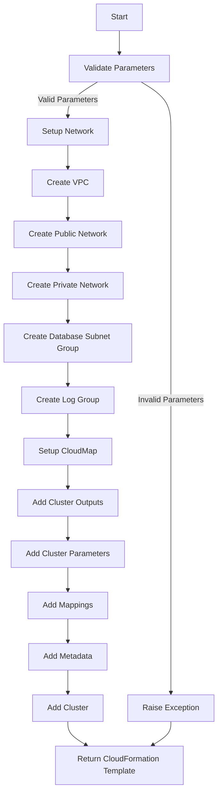
```mermaid
graph TD;
    A[Start] --> B[Validate Parameters]
    B -- Invalid Parameters --> C[Raise Exception]
    B -- Valid Parameters --> D[Setup Network]
    D --> E[Create VPC]
    E --> F[Create Public Network]
    F --> G[Create Private Network]
    G --> H[Create Database Subnet Group]
    H --> I[Create Log Group]
    I --> J[Setup CloudMap]
    J --> K[Add Cluster Outputs]
    K --> L[Add Cluster Parameters]
    L --> M[Add Mappings]
    M --> N[Add Metadata]
    N --> O[Add Cluster]
    O --> P[Return CloudFormation Template]
    C --> P

```
Now CloudFormation will create a new stack with the following components:

**VPC Setup:**

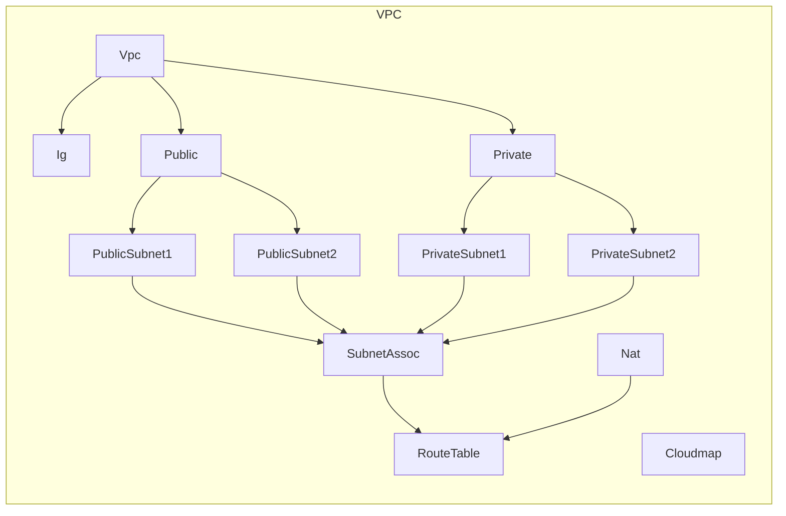
```mermaid
graph LR
  subgraph VPC
    Vpc[Vpc]
    Ig[Ig]
    Public[Public]
    Private[Private]
    Nat[Nat]
    Cloudmap[Cloudmap]
    Vpc --> Ig
    Vpc --> Public
    Vpc --> Private
    Public --> PublicSubnet1
    Public --> PublicSubnet2
    Private --> PrivateSubnet1
    Private --> PrivateSubnet2
    PublicSubnet1 --> SubnetAssoc
    PublicSubnet2 --> SubnetAssoc
    PrivateSubnet1 --> SubnetAssoc
    PrivateSubnet2 --> SubnetAssoc
    SubnetAssoc --> RouteTable
    Nat --> RouteTable
  end
```

**EC2 Instances:**

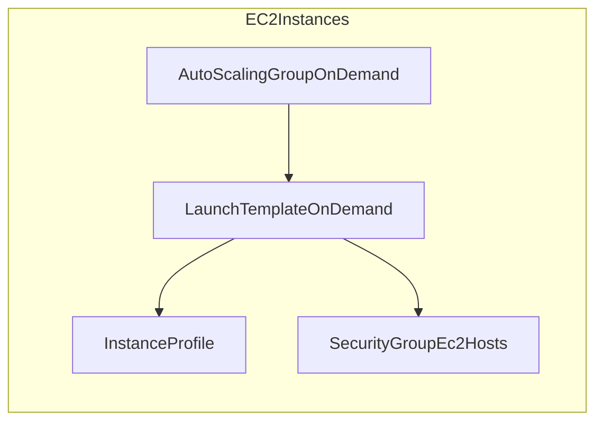
```mermaid
graph LR
  subgraph EC2Instances
    LaunchTemplateOnDemand[LaunchTemplateOnDemand]
    AutoScalingGroupOnDemand[AutoScalingGroupOnDemand]
    InstanceProfile[InstanceProfile]
    SecurityGroupEc2Hosts[SecurityGroupEc2Hosts]
    LaunchTemplateOnDemand --> InstanceProfile
    LaunchTemplateOnDemand --> SecurityGroupEc2Hosts
    AutoScalingGroupOnDemand --> LaunchTemplateOnDemand
  end
```
Please note that the creation of `Auto Scaling Group` is determined by the specified configuration. If only `Spot` instances or only `On-Demand` instances are selected, the corresponding type will be created. However, if both `Spot` and `On-Demand` instances are chosen in the configuration, both types will be created.
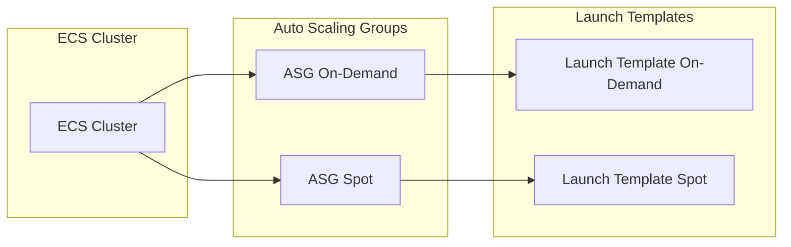
```mermaid
graph LR

subgraph ECS Cluster
    cluster[ECS Cluster]
end

subgraph Auto Scaling Groups
    asgOnDemand[ASG On-Demand]
    asgSpot[ASG Spot]
end

subgraph Launch Templates
    ltOnDemand[Launch Template On-Demand]
    ltSpot[Launch Template Spot]
end

cluster --> asgOnDemand
cluster --> asgSpot
asgOnDemand --> ltOnDemand
asgSpot --> ltSpot

```


**ECS Cluster:**

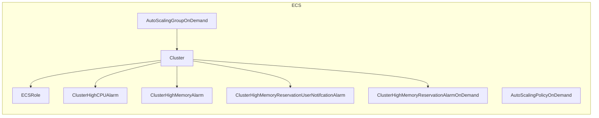
```mermaid
graph LR
  subgraph ECS
    Cluster[Cluster]
    ECSRole[ECSRole]
    AutoScalingPolicyOnDemand[AutoScalingPolicyOnDemand]
    ClusterHighCPUAlarm[ClusterHighCPUAlarm]
    ClusterHighMemoryAlarm[ClusterHighMemoryAlarm]
    ClusterHighMemoryReservationUserNotifcationAlarm[ClusterHighMemoryReservationUserNotifcationAlarm]
    ClusterHighMemoryReservationAlarmOnDemand[ClusterHighMemoryReservationAlarmOnDemand]
    AutoScalingGroupOnDemand --> Cluster
    Cluster --> ECSRole
    Cluster --> ClusterHighCPUAlarm
    Cluster --> ClusterHighMemoryAlarm
    Cluster --> ClusterHighMemoryReservationUserNotifcationAlarm
    Cluster --> ClusterHighMemoryReservationAlarmOnDemand
  end
```

**Other Resources:**

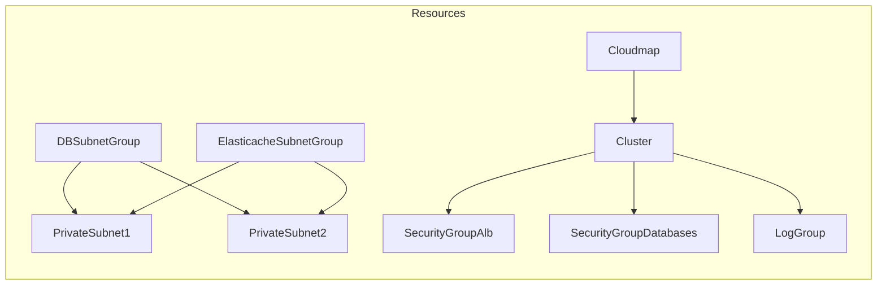
```mermaid
graph LR
  subgraph Resources
    DBSubnetGroup[DBSubnetGroup]
    ElasticacheSubnetGroup[ElasticacheSubnetGroup]
    LogGroup[LogGroup]
    SecurityGroupAlb[SecurityGroupAlb]
    SecurityGroupDatabases[SecurityGroupDatabases]
    DBSubnetGroup --> PrivateSubnet1
    DBSubnetGroup --> PrivateSubnet2
    ElasticacheSubnetGroup --> PrivateSubnet1
    ElasticacheSubnetGroup --> PrivateSubnet2
    Cloudmap --> Cluster
    Cluster --> SecurityGroupAlb
    Cluster --> SecurityGroupDatabases
    Cluster --> LogGroup
  end
```
**Note:** It is important to understand that the above information provides a high-level overview of the stacks. For a more comprehensive understanding, we recommend utilizing the AWS CloudFormation template designer and exploring the properties available in the AWS Management Console. These tools will allow you to investigate further and gain deeper insights into the stacks' functionalities and configurations.

## `ii. create_service`
The main entry point of `create_service` is in `cloudlift/__init__.py`. The command invokes `create_service` function in the module, which again runs a method of [ServiceCreator](#servicecreator) class whose responsibility is to create and update ECS and cloudlift services.
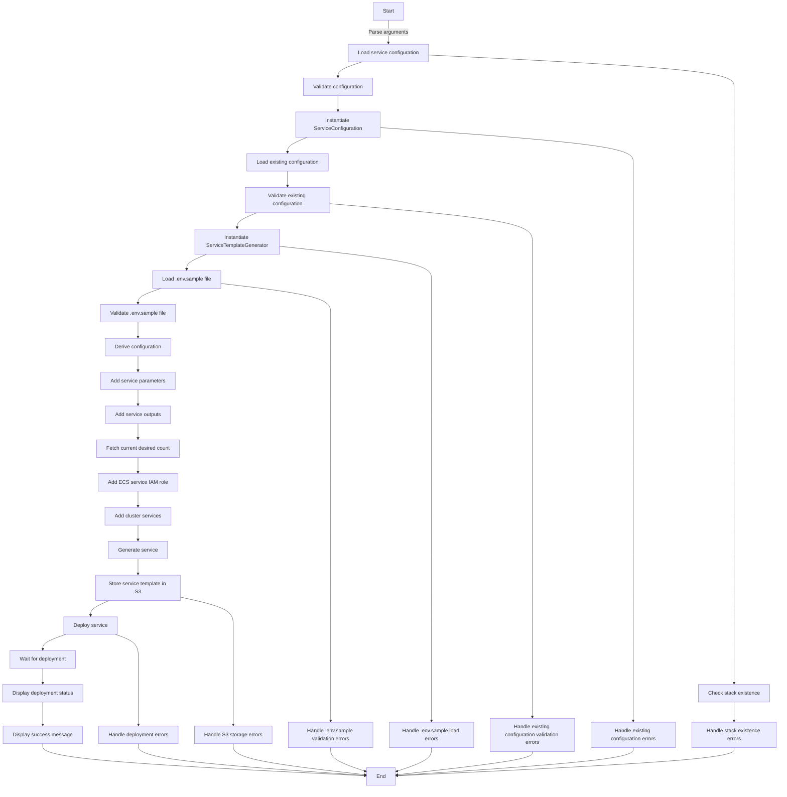
```mermaid
graph TD
    A[Start]
    A -->|Parse arguments| B[Load service configuration]
    B --> C[Validate configuration]
    C --> D[Instantiate ServiceConfiguration]
    D --> E[Load existing configuration]
    E --> F[Validate existing configuration]
    F --> G[Instantiate ServiceTemplateGenerator]
    G --> H[Load .env.sample file]
    H --> I[Validate .env.sample file]
    I --> J[Derive configuration]
    J --> K[Add service parameters]
    K --> L[Add service outputs]
    L --> M[Fetch current desired count]
    M --> N[Add ECS service IAM role]
    N --> O[Add cluster services]
    O --> P[Generate service]
    P --> Q[Store service template in S3]
    Q --> R[Deploy service]
    R --> S[Wait for deployment]
    S --> T[Display deployment status]
    T --> U[Display success message]
    U --> V[End]
    B --> W[Check stack existence]
    W --> X[Handle stack existence errors]
    X --> V
    D --> Y[Handle existing configuration errors]
    Y --> V
    F --> Z[Handle existing configuration validation errors]
    Z --> V
    G --> AA[Handle .env.sample load errors]
    AA --> V
    H --> AB[Handle .env.sample validation errors]
    AB --> V
    Q --> AC[Handle S3 storage errors]
    AC --> V
    R --> AD[Handle deployment errors]
    AD --> V
```

Here's an explanation of each step:
- Load service configuration: The configuration file for the service is loaded to retrieve the service-specific settings and parameters.

- Validate configuration: The loaded service configuration is validated to ensure that it adheres to the required structure and format.

- Instantiate [ServiceConfiguration](#serviceconfiguration): The ServiceConfiguration object is created to handle the service configuration, providing methods for accessing and manipulating the configuration data.

- Load existing configuration: If there is an existing configuration for the service, it is loaded for comparison and updating purposes.

- Validate existing configuration: The loaded existing configuration is validated to ensure its correctness and compatibility with the new changes.

- Instantiate [ServiceTemplateGenerator](#servicetemplategenerator): The ServiceTemplateGenerator object is created, which is responsible for generating the CloudFormation template for the service.

- Load .env.sample file: The `.env.sample` file is loaded as a reference to provide an example environment variable configuration for the service.

- Validate .env.sample file: The loaded `.env.sample` file is validated to ensure its correctness and adherence to the required format.

- Handle .env.sample validation errors: If there are errors in the validation of the `.env.sample` file, appropriate error handling and messages are implemented to guide the user in resolving the issues.

- Derive configuration: The derived configuration is created by combining the loaded service configuration, existing configuration, and the validated `.env.sample` file. This step includes resolving any missing or default values.

- Add service parameters: Service-specific parameters, such as container definitions and environment variables, are added to the CloudFormation template. These parameters define how the service should run.

- Add service outputs: Outputs specific to the service, such as the ECS service name and URL, are added to the CloudFormation template. These outputs provide information about the deployed service.

- Fetch current desired count: The current desired count of the service is fetched to determine the scale of the update. This count represents the number of tasks or instances

**High Level Overview of the Stack**
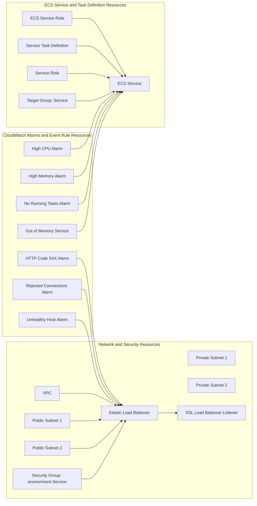
```mermaid

flowchart LR

subgraph Network and Security Resources

VPC[VPC]

PublicSubnet1[Public Subnet 1]

PublicSubnet2[Public Subnet 2]

PrivateSubnet1[Private Subnet 1]

PrivateSubnet2[Private Subnet 2]

SGenvironmentService[Security Group: environment-Service]

SslLoadBalancerListenerService[SSL Load Balancer Listener]

ALBService[Elastic Load Balancer]

end

subgraph ECS Service and Task Definition Resources

ECSServiceRole[ECS Service Role]

ServiceTaskDefinition[Service Task Definition]

ServiceRole[Service Role]

Service[ECS Service]

TargetGroupService[Target Group: Service]

end

subgraph CloudWatch Alarms and Event Rule Resources

EcsHighCPUAlarmService[High CPU Alarm]

EcsHighMemoryAlarmService[High Memory Alarm]

EcsNoRunningTasksAlarmService[No Running Tasks Alarm]

EcsOOMService[Out of Memory Service]

ElbHTTPCodeELB5xxAlarmService[HTTP Code 5XX Alarm]

ElbRejectedConnectionsAlarmService[Rejected Connections Alarm]

ElbUnhealthyHostAlarmService[Unhealthy Host Alarm]

end

VPC --> ALBService

PublicSubnet1 --> ALBService

PublicSubnet2 --> ALBService

SGenvironmentService --> ALBService

ALBService --> SslLoadBalancerListenerService

ECSServiceRole --> Service

ServiceTaskDefinition --> Service

ServiceRole --> Service

TargetGroupService --> Service

EcsHighCPUAlarmService --> Service

EcsHighMemoryAlarmService --> Service

EcsNoRunningTasksAlarmService --> Service

EcsOOMService --> Service

ElbHTTPCodeELB5xxAlarmService --> ALBService

ElbRejectedConnectionsAlarmService --> ALBService

ElbUnhealthyHostAlarmService --> ALBService

```

## `iii. deploy_service`
`deploy_service` creates a new docker image and also uploads to ECR. It also creates a new `Task Definition`. The entry point of `deploy_service` is again in `__init__.py`, the `deploy_service` function. The function invokes a `run` method on [ServiceUpdater](#serviceupdater) class whose responsibility is to deploy cloudlift services.
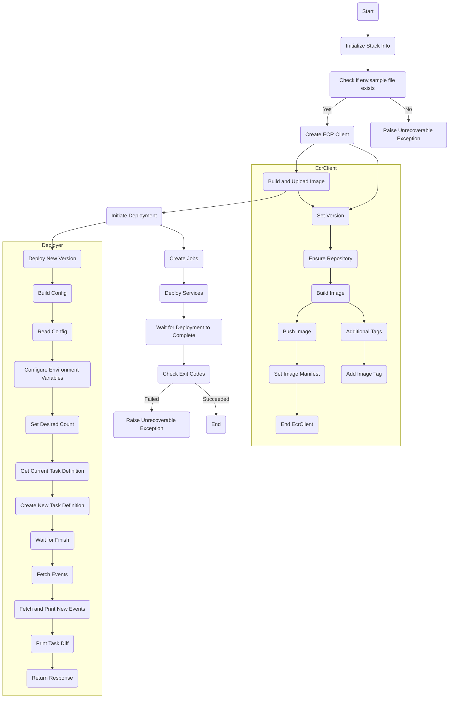
```mermaid
graph  TD
A(Start)  -->  B(Initialize Stack Info)
B  -->  C(Check if env.sample file exists)
C  -- Yes -->  D(Create ECR Client)
D  -->  E(Build and Upload Image)
E  -->  F(Initiate Deployment)
F  -->  G(Create Jobs)
G  -->  H(Deploy Services)
H  -->  I(Wait for Deployment to Complete)
I  -->  J(Check Exit Codes)
J  -- Failed -->  K(Raise Unrecoverable Exception)
J  -- Succeeded -->  L(End)
C  -- No -->  M(Raise Unrecoverable Exception)
subgraph  EcrClient
P(Initialize ECR Client)
P  -->  Q(Ensure Repository)
Q  -->  R(Build Image)
R  -->  S(Push Image)
S  -->  T(Set Image Manifest)
T  -->  U(End EcrClient)
R  -->  V(Additional Tags)
V  -->  W(Add Image Tag)
E  -->  P(Set Version)
end
D  -->  P
subgraph  Deployer
X(Deploy New Version)
X  -->  Y(Build Config)
Y  -->  Z(Read Config)
Z  -->  AA(Configure Environment Variables)
AA  -->  AB(Set Desired Count)
AB  -->  AC(Get Current Task Definition)
AC  -->  AD(Create New Task Definition)
AD  -->  AE(Wait for Finish)
AE  -->  AF(Fetch Events)
AF  -->  AG(Fetch and Print New Events)
AG  -->  AH(Print Task Diff)
AH  -->  AI(Return Response)
end
F  -->  X
```
Here's a description of the flowchart:

1. The process starts by initializing the stack information and checking if the `env.sample` file exists.

2. If the `env.sample` file exists, an ECR (Elastic Container Registry) client is created, which is responsible for managing the container image repository.

3. The ECR client builds and uploads the Docker image based on the provided name and version.

4. The deployment process is initiated, and jobs are created for deploying services. Each job represents the deployment of a specific service.

5. For each service, the deployment process involves setting the desired count for the service, getting the current task definition, and creating a new task definition based on the updated image.

6. Environment variables are configured for the containers using the provided sample environment file.

7. The desired count for the service is determined. If it is currently set to 0, it is updated to 1 to ensure the service is running.

8. The current task definition is retrieved, and a new task definition is created by updating the image URL to the new version.

9. The deployment waits for the deployment to complete by continuously checking for events and waiting until there are no more events or errors in the service.

10. The deployment process checks the exit codes of the jobs. If any of the exit codes indicate a failure, an unrecoverable exception is raised. Otherwise, the deployment is considered successful.

11. Finally, the process ends.

**Note:** The flowchart focuses on the main sequence of steps and does not cover all possible branching paths or exceptional scenarios that may be present in the actual code.

## `iv update_service`

The `update` method in the [ServiceCreator](#servicecreator) class is responsible for updating an existing ECS service and its related dependencies using CloudFormation templates.

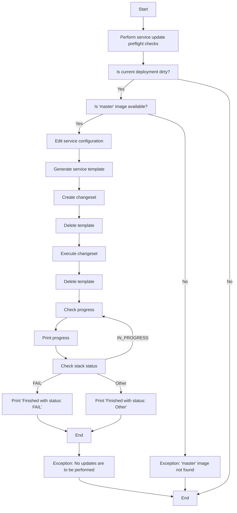
```mermaid
graph TD
A[Start] --> B[Perform service update preflight checks]
B --> C[Is current deployment dirty?]
C -- Yes --> D[Is 'master' image available?]
D -- Yes --> E[Edit service configuration]
E --> F[Generate service template]
F --> G[Create changeset]
G --> H[Delete template]
H --> I[Execute changeset]
I --> J[Delete template]
J --> K[Check progress]
K --> L[Print progress]
L --> M[Check stack status]
M -- IN_PROGRESS --> K
M -- FAIL --> N[Print 'Finished with status: FAIL']
M -- Other --> O[Print 'Finished with status: Other']
N --> P[End]
O --> P[End]
P --> Q[Exception: No updates are to be performed]
Q --> R[End]
D -- No --> S[Exception: 'master' image not found]
S --> R
C -- No --> R
```
A pre-flight check is conducted to ensure that an image labeled as `master` is uploaded to the Elastic Container Registry (ECR). This check is necessary because when utilizing the cloudlift template, the default tag set by cloudlift is `master`. However, when deploying using the `deploy_service` command from a worktree that is not clean, cloudlift generates a task definition with a Docker image labeled as "dirty." As a result, when attempting to update the service through CloudFormation, it fails to locate the image with the `master` tag, causing the task to remain idle without starting again.

## Class Diagrams

#### EnvrionmentConfiguration
`cloudlift/config/environment_configuration.py`

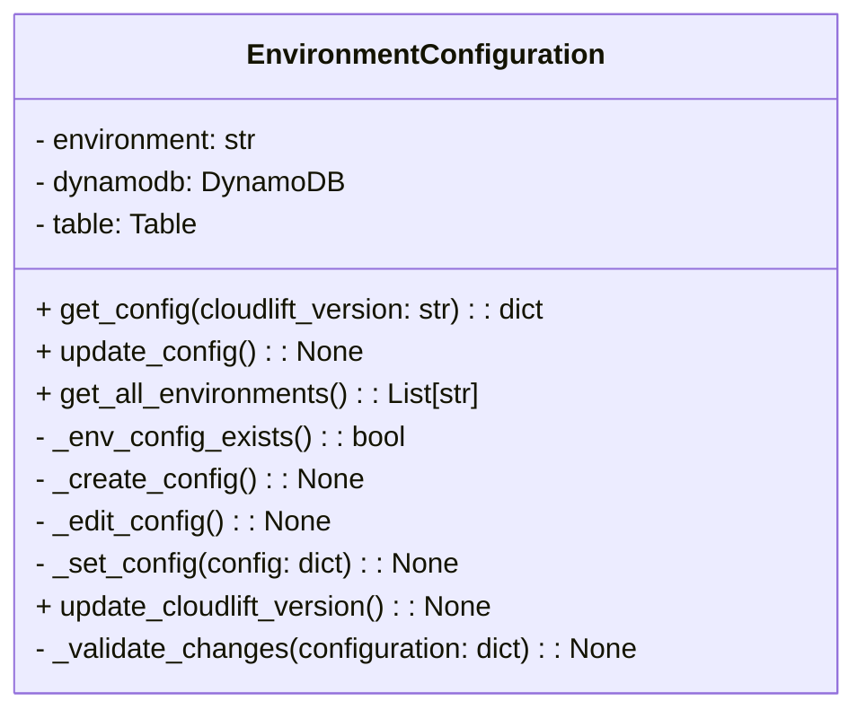
```mermaid
classDiagram
    class EnvironmentConfiguration {
        - environment: str
        - dynamodb: DynamoDB
        - table: Table
        + get_config(cloudlift_version: str) : dict
        + update_config() : None
        + get_all_environments() : List[str]
        - _env_config_exists() : bool
        - _create_config() : None
        - _edit_config() : None
        - _set_config(config: dict) : None
        + update_cloudlift_version() : None
        - _validate_changes(configuration: dict) : None
    }

```
#### EnvrionmentCreator
`cloudlift/deployment/environment_creator.py`
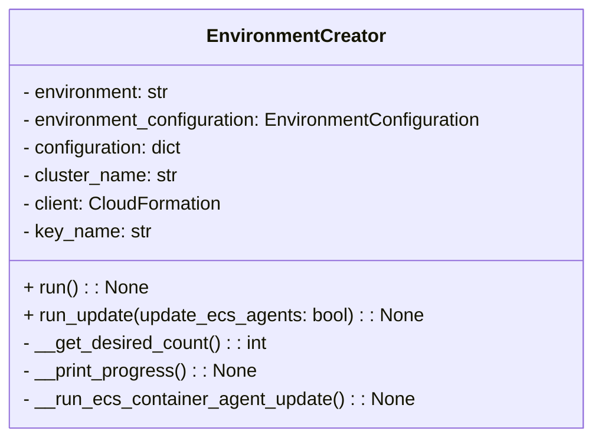
```mermaid
classDiagram
    class EnvironmentCreator {
        - environment: str
        - environment_configuration: EnvironmentConfiguration
        - configuration: dict
        - cluster_name: str
        - client: CloudFormation
        - key_name: str
        + run() : None
        + run_update(update_ecs_agents: bool) : None
        - __get_desired_count() : int
        - __print_progress() : None
        - __run_ecs_container_agent_update() : None
    }

```
#### ClusterTemplateGenerator
`cloudlift/deployment/cluster_template_generator.py`

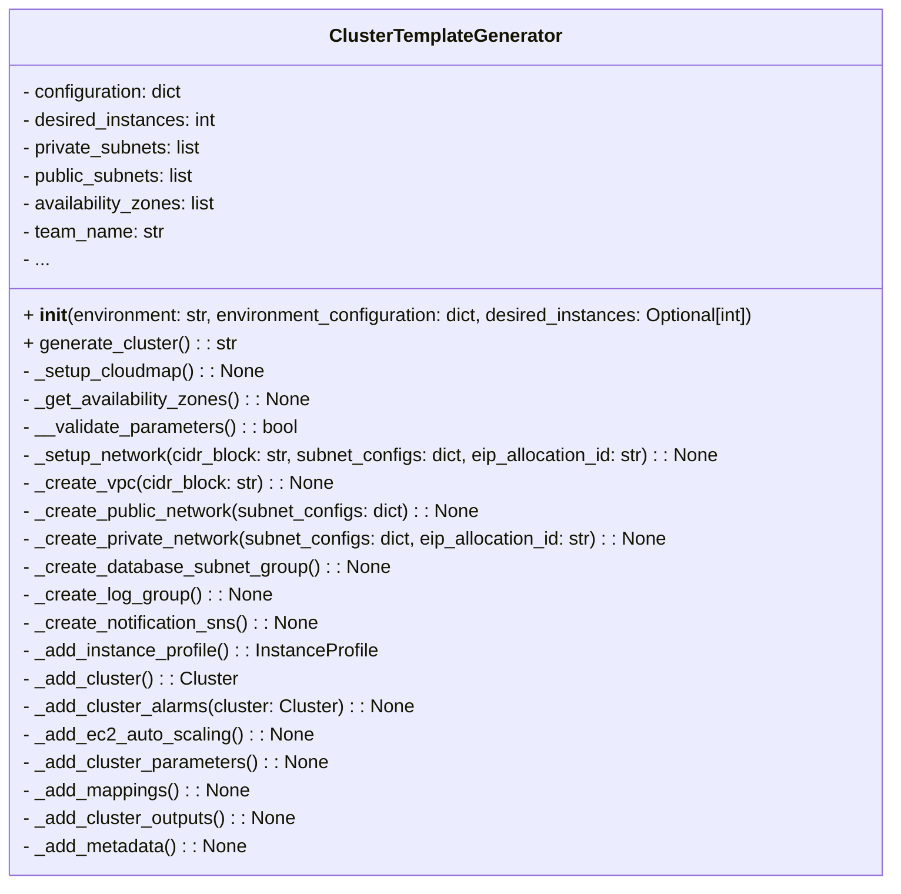
```mermaid
classDiagram
    class ClusterTemplateGenerator {
        - configuration: dict
        - desired_instances: int
        - private_subnets: list
        - public_subnets: list
        - availability_zones: list
        - team_name: str
        + __init__(environment: str, environment_configuration: dict, desired_instances: Optional[int])
        + generate_cluster(): str
        - _setup_cloudmap(): None
        - _get_availability_zones(): None
        - __validate_parameters(): bool
        - _setup_network(cidr_block: str, subnet_configs: dict, eip_allocation_id: str): None
        - _create_vpc(cidr_block: str): None
        - _create_public_network(subnet_configs: dict): None
        - _create_private_network(subnet_configs: dict, eip_allocation_id: str): None
        - _create_database_subnet_group(): None
        - _create_log_group(): None
        - _create_notification_sns(): None
        - _add_instance_profile(): InstanceProfile
        - _add_cluster(): Cluster
        - _add_cluster_alarms(cluster: Cluster): None
        - _add_ec2_auto_scaling(): None
        - _add_cluster_parameters(): None
        - _add_mappings(): None
        - _add_cluster_outputs(): None
        - _add_metadata(): None
	    - ...
    }
```
#### ServiceConfiguration
`cloudlift/config/service_configuration.py`

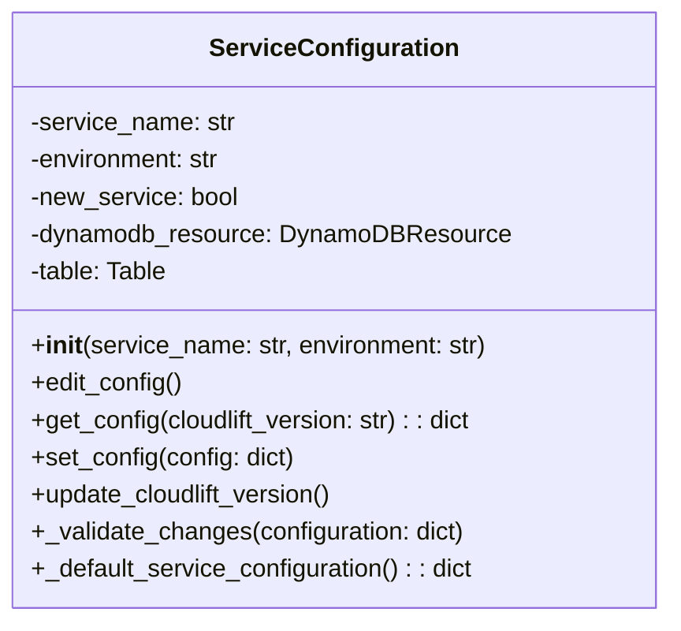
```mermaid
classDiagram
    class ServiceConfiguration {
        -service_name: str
        -environment: str
        -new_service: bool
        -dynamodb_resource: DynamoDBResource
        -table: Table
        +__init__(service_name: str, environment: str)
        +edit_config()
        +get_config(cloudlift_version: str) : dict
        +set_config(config: dict)
        +update_cloudlift_version()
        +_validate_changes(configuration: dict)
        +_default_service_configuration(): dict
    }
```
The `ServiceConfiguration` class represents the handling of service configuration in DynamoDB. It provides methods for storing, editing, and retrieving service configuration.

#### ServiceCreator
`cloudlift/deployment/service_creator.py`
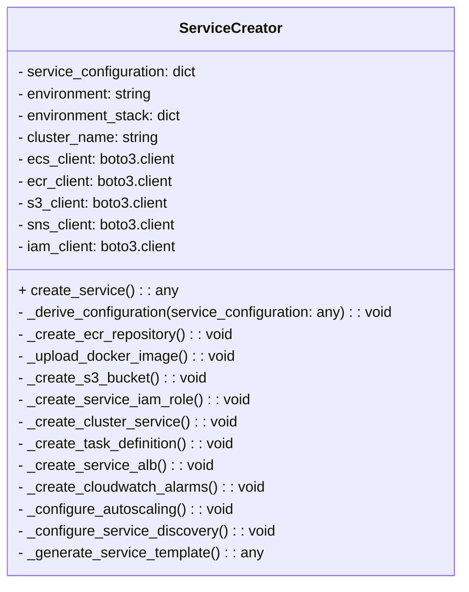
```mermaid
classDiagram
    class ServiceCreator {
        - service_configuration: dict
        - environment: string
        - environment_stack: dict
        - cluster_name: string
        - ecs_client: boto3.client
        - ecr_client: boto3.client
        - s3_client: boto3.client
        - sns_client: boto3.client
        - iam_client: boto3.client
        + create_service(): any
        - _derive_configuration(service_configuration: any): void
        - _create_ecr_repository(): void
        - _upload_docker_image(): void
        - _create_s3_bucket(): void
        - _create_service_iam_role(): void
        - _create_cluster_service(): void
        - _create_task_definition(): void
        - _create_service_alb(): void
        - _create_cloudwatch_alarms(): void
        - _configure_autoscaling(): void
        - _configure_service_discovery(): void
        - _generate_service_template(): any
    }
```

The `ServiceCreator` class is responsible for creating a service based on the provided service configuration. It interacts with various AWS services such as ECR, S3, ECS, IAM, etc., to create and configure the necessary resources for the service. The `create_service()` method is the entry point for creating the service, and it internally calls other private methods to perform the specific creation tasks.
#### ServiceTemplateGenerator
`cloudlift/deployment/service_template_generator.py`

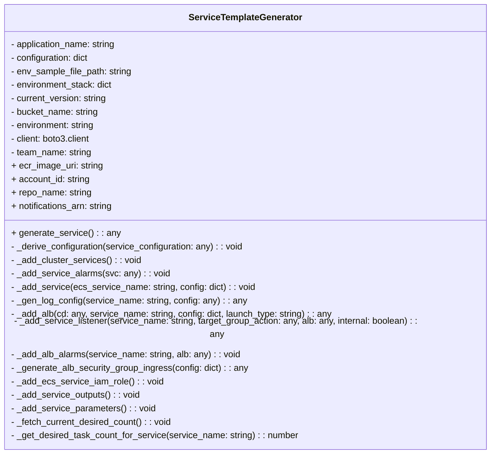
```mermaid
classDiagram
    class ServiceTemplateGenerator {
        - application_name: string
        - configuration: dict
        - env_sample_file_path: string
        - environment_stack: dict
        - current_version: string
        - bucket_name: string
        - environment: string
        - client: boto3.client
        - team_name: string
        + generate_service(): any
        - _derive_configuration(service_configuration: any): void
        - _add_cluster_services(): void
        - _add_service_alarms(svc: any): void
        - _add_service(ecs_service_name: string, config: dict): void
        - _gen_log_config(service_name: string, config: any): any
        - _add_alb(cd: any, service_name: string, config: dict, launch_type: string): any
        - _add_service_listener(service_name: string, target_group_action: any, alb: any, internal: boolean): any
        - _add_alb_alarms(service_name: string, alb: any): void
        - _generate_alb_security_group_ingress(config: dict): any
        - _add_ecs_service_iam_role(): void
        - _add_service_outputs(): void
        - _add_service_parameters(): void
        - _fetch_current_desired_count(): void
        - _get_desired_task_count_for_service(service_name: string): number
        + ecr_image_uri: string
        + account_id: string
        + repo_name: string
        + notifications_arn: string
    }

```
The `ServiceTemplateGenerator` class is responsible for generating a CloudFormation template for a service based on the provided service configuration. It utilizes the Troposphere library to define the infrastructure resources, including ECS task definitions, services, load balancers, alarms, IAM roles, etc. The class handles the generation of YAML templates, storing them in an S3 bucket if they exceed a certain size.

#### ServiceInformationFetcher
`cloudlift/deployment/service_information_fetcher.py`
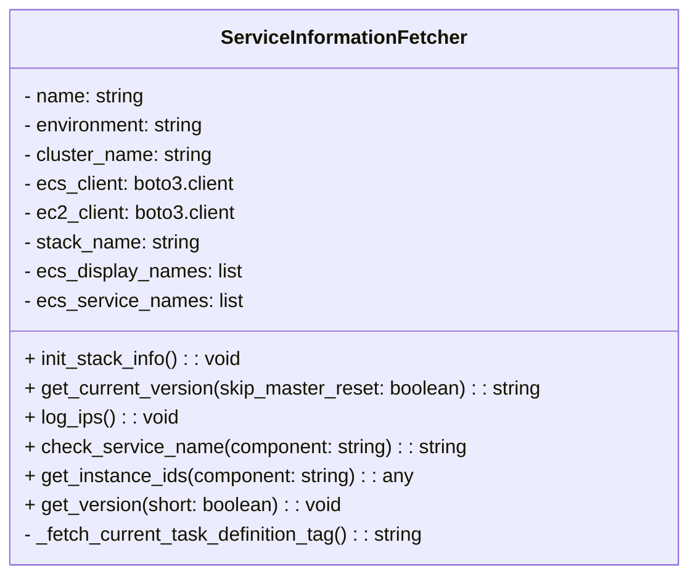
```mermaid
classDiagram
    class ServiceInformationFetcher {
        - name: string
        - environment: string
        - cluster_name: string
        - ecs_client: boto3.client
        - ec2_client: boto3.client
        - stack_name: string
        - ecs_display_names: list
        - ecs_service_names: list
        + init_stack_info(): void
        + get_current_version(skip_master_reset: boolean): string
        + log_ips(): void
        + check_service_name(component: string): string
        + get_instance_ids(component: string): any
        + get_version(short: boolean): void
        - _fetch_current_task_definition_tag(): string
    }

```
The `ServiceInformationFetcher` class is responsible for retrieving information about a service deployed in an AWS ECS cluster. It interacts with AWS services such as ECS, EC2, and CloudFormation to fetch details like the currently deployed version, associated task definitions, container instance information, and IP addresses. The class provides methods to fetch service information, log IP addresses, check service names, and retrieve instance IDs. It also has a method to fetch the currently deployed version of the service, including the currently deployed docker image tag (or tagged commit hash) of associated task definition.

#### `ServiceUpdater`
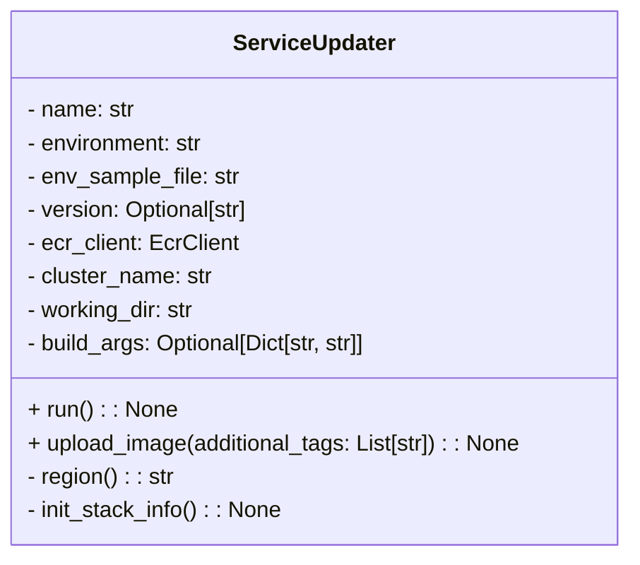
```mermaid
classDiagram
    class ServiceUpdater {
        - name: str
        - environment: str
        - env_sample_file: str
        - version: Optional[str]
        - ecr_client: EcrClient
        - cluster_name: str
        - working_dir: str
        - build_args: Optional[Dict[str, str]]
        + run(): None
        + upload_image(additional_tags: List[str]): None
        - region(): str
        - init_stack_info(): None
    }

```
The `ServiceUpdater` class serves as a central orchestrator for the deployment process, coordinating the interactions between the ECR client, ECS cluster, and other components involved in deploying and updating the service.

## A Tale of Cloudlift: Streamlining Deployments with Simplicity

<details>
<summary>Accelerating Deployment with Cloudlift: Unveiling the Story of Speed and Efficiency</summary>

Once upon a time in a bustling organization called FusionCorp, there were several teams dedicated to creating amazing software solutions. Among them were the talented developers who worked tirelessly to build and improve the company's applications. Alongside these developers, there was a team of skilled DevOps engineers responsible for managing the infrastructure and deployment processes.

At FusionCorp, they heavily relied on Amazon Web Services (AWS) for their cloud infrastructure needs. They utilized Amazon Elastic Container Service (ECS) to run their applications in containers, and Docker played a pivotal role in packaging and deploying these containers.

The developers at FusionCorp were passionate about following best practices, and one such practice they adhered to was the 12-factor app design. This design philosophy ensured that their applications were scalable, maintainable, and portable across different environments.

In the early days of FusionCorp, deploying a new service to the cloud was quite a challenge. Developers had to coordinate with the DevOps team, providing them with all the necessary deployment information. They would hand over the Dockerfile, environment variables, and any other relevant configurations. The DevOps team would then manually set up the required infrastructure, including VPCs, subnets, security groups, alarms, and log management. It was a tedious and time-consuming process for both teams.

However, everything changed when Cloudlift entered the scene. Cloudlift was a powerful in-house infrastructure tool developed by the DevOps team at `Simpl`. It aimed to simplify the process of creating and deploying ECS workloads, specifically catering to the needs of the application engineers.

Let's meet James, one of the enthusiastic developers at FusionCorp. James was working on a new project—a payment backend written in Go. Traditionally, he would have to reach out to the DevOps team, providing them with all the deployment details, which changed every week due to iterative development. It was a back-and-forth communication that slowed down the deployment process and created unnecessary dependencies.

With Cloudlift, however, James had newfound independence. He could create new services all by himself, including his payment backend. The tool empowered him to take control of the deployment process. No longer did he have to wait for the DevOps team's availability or worry about miscommunication.

James started by installing Cloudlift on his development machine. He had a working Python environment with Python 3.6, and a simple command—`pip install -U --user cloudlift`—brought the tool to life. He verified the installation by running `cloudlift --version`, ensuring he had the latest version.

Armed with Cloudlift, James was now ready to embark on his deployment journey. He navigated to the project directory and found a helpful `env.sample` file waiting for him. This file contained key-value pairs representing environment variables required by his application. James made sure to commit this file along with his code to keep everything in sync.

Next, he used the `cloudlift edit_config` command to set the environment variables specific to each environment. James provided the desired values, ensuring they matched the keys in the `env.sample` file. Cloudlift validated this bidirectionally, ensuring consistency between the configuration and the environment.

Excited about his progress, James proceeded to create a service using Cloudlift. He executed the `cloudlift create_service` command, specifying the environment. A service configuration template opened in his favorite editor, ready to be customized. James fine-tuned the settings, defining the runtime parameters for his payment backend. He even had the flexibility to include a web application and a job scheduler within the same service, as his backend required. Cloudlift was versatile enough to handle multiple components within a single service.

After creating the service, James was able to deploy it effortlessly using the `cloudlift deploy_service` command. Cloudlift seamlessly integrated with the Git workflow, ensuring a smooth deployment process. Cloudlift leveraged the power of Git to determine if a deployment was `"dirty"` or not. A `"dirty"` version meant that the deployment was made from a Git worktree that contained untracked or uncommitted files. In such cases, the deployed build would be tagged as `dirty`.

James was relieved to know that Cloudlift handled the heavy lifting behind the scenes. During deployment, Cloudlift automatically built the Docker image, tagged it as either `dirty` or with the commit ID of the current `HEAD`, uploaded it to the container repository, and deployed it to the ECS service. It even smartly skipped the build step if an image with the same commit ID already existed in the container registry, saving time and resources.

As James continued to work on his payment backend, he realized that Cloudlift offered even more advanced features. For example, he learned about leveraging Fargate, a serverless compute engine for containers. This allowed him to run his services without having to manage the underlying infrastructure, further simplifying the deployment process.

Additionally, Cloudlift provided the ability to `create` and `update` task definitions, giving James fine-grained control over the configuration of his ECS tasks. This flexibility allowed him to adapt to changing requirements and optimize resource allocation.

In times of troubleshooting, James found the Cloudlift documentation to be a valuable resource. It offered insights into common issues, such as outdated Cloudlift versions conflicting with service creation or attempting to update a resource that didn't exist yet.

Thanks to Cloudlift, James and his fellow developers at FusionCorp experienced newfound freedom and efficiency in deploying their services. They were no longer dependent on the DevOps team for every deployment, and the process became streamlined and faster. The collaboration between developers and DevOps engineers improved as well, as they could focus on their respective areas of expertise without unnecessary bottlenecks.

FusionCorp's journey with Cloudlift proved to be a success story. The developers could unleash their creativity and bring innovative solutions to life, while the DevOps team could focus on managing and optimizing the underlying infrastructure. Together, they propelled FusionCorp's applications to new heights, empowered by the simplicity and power of Cloudlift.

Note that Cloudlift was not limited to manual usage by individual developers alone. It played a crucial role in the organization's CI/CD (Continuous Integration/Continuous Deployment) pipeline as well. Integration with CI/CD tools enabled automatic deployment of new versions of services and applications upon successful code merges.

FusionCorp had a well-established CI/CD workflow in place. Whenever a developer pushed their code changes to the version control system, the CI/CD pipeline would kick in. This pipeline would run various tests, perform code quality checks, and ensure that the changes were ready for deployment.

As part of this automated process, Cloudlift seamlessly integrated with the CI/CD tools. After the code successfully passed all tests and checks, Cloudlift was triggered to deploy the new version of the service to the appropriate environment.

FusionCorp had a range of environments set up to facilitate different stages of development and testing. The `"Unicorn"` environment was dedicated to integration tests within the CI/CD pipeline. `"Staging"` served as the development environment for testing and validation. The `"Sandbox"` environment was specifically designed for merchant integration, enabling seamless testing of the application with external partners. Finally, the `"Production"` environment was where the live, customer-facing services resided.

Cloudlift supported all these environments, allowing developers and the CI/CD pipeline to deploy services to each one effortlessly. Each environment had a corresponding ECS cluster associated with it. For instance, the "Staging" environment had its own ECS cluster named "staging-cluster." This clear mapping ensured that services were deployed to the correct clusters and isolated appropriately.

Thanks to Cloudlift's tight integration with the CI/CD pipeline, developers at FusionCorp could focus on writing code and delivering new features without worrying about the intricate details of the deployment process. With a successful code merge, Cloudlift would automatically deploy the new version of the service to the desired environment, be it `"Unicorn,"`  `"Staging,"`  `"Sandbox,"` or `"Production."` This seamless integration enabled faster iterations, continuous delivery, and efficient collaboration between the development and operations teams.

Cloudlift became an indispensable tool in FusionCorp's CI/CD ecosystem, empowering developers to deliver high-quality software and ensuring smooth and reliable deployments across various environments.
___
_Please note that all characters and organizations mentioned in the story are fictional, except for Simpl, the original creator of Cloudlift. Simpl's innovative approach to infrastructure management led to the development of Cloudlift, revolutionizing the deployment process._

</details>
